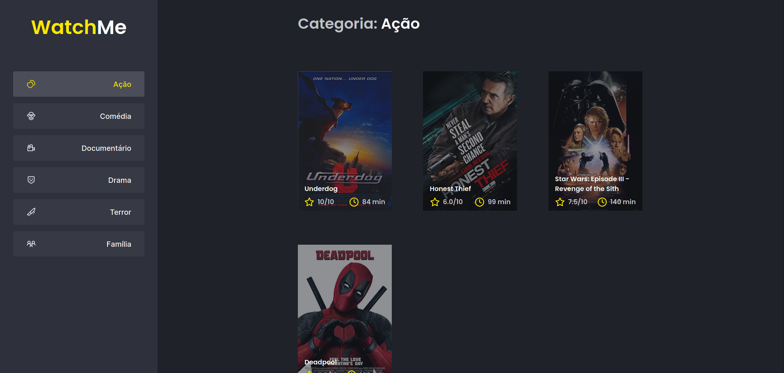

  
  
      

 

  

<h3 align="center">
  Desafio 09 - Trilha ReactJS
</h2>

	Resolução do Desafio "Otimizando a Aplicação"

## Sobre o desafio

  

Nesse desafio você deverá performar uma aplicação React utilizando das ferramentas e dicas aprendidas durante o módulo **Performando apps com ReactJS**.

Se você fez o desafio opcional [Componentizando a aplicação](https://github.com/vitorpedeo/desafio-componentizando-aplicacao) deve lembrar que se trata de uma aplicação que exibe uma listagem de filmes por categoria com base na categoria selecionada e que esses dados vem de uma API (fake API com JSON Server).

Com essa aplicação componentizada, você deve aplicar os conceitos de performance no React para melhorar esse app.
## Status do desafio

✅ Completo